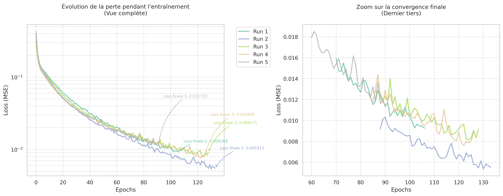
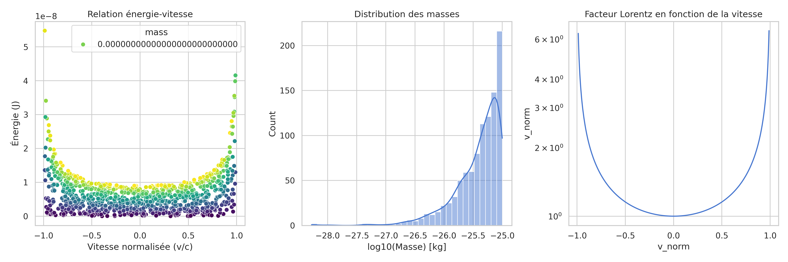

# Projet Relativité - Modélisation de l'Énergie Relativiste par Réseaux de Neurones

## 📖 Introduction

Ce projet démontre l'application de l'apprentissage automatique pour modéliser l'énergie relativiste totale d'une particule, en s'appuyant sur les principes de la relativité restreinte d'Einstein. Il sert de pont entre la physique théorique et les méthodes modernes de data science, offrant :

- **Un outil pédagogique** pour visualiser les effets relativistes
- **Une base reproductible** pour l'expérimentation avec des modèles de régression
- **Un cadre méthodologique** pour l'intégration de lois physiques dans des pipelines ML

Applications potentielles :
- Simulation rapide pour l'enseignement de la physique
- Benchmark de modèles sur des relations non-linéaires complexes
- Étude de la robustesse des MLPs face aux variations d'échelle

## 🗂 Structure du Projet

```
.
├── main.py                  # Pipeline de génération de données et d'entraînement
├── visualization.py         # Analyse post-entraînement et visualisations
├── requirements.txt         # Dépendances avec versions contrôlées
├── analysis.json            # Sortie des métriques d'entraînement (généré)
└── visualizations/          # Dossier des résultats graphiques (généré)
```

## 🚀 Fonctionnalités Clés

### 1. Génération de Données Scientifiquement Valides (`main.py`)
- **Équation de base** :  
  \( E = \frac{mc^2}{\sqrt{1 - (v/c)^2}} \)  
  Implémentée vectoriellement avec NumPy pour une performance optimale

- **Plages réalistes** :
  | Variable | Intervalle | Unité |
  |----------|------------|-------|
  | Masse    | [1e-30, 1e-25] | kg |
  | Vitesse  | [-0.99c, 0.99c] | m/s |

- **Contrôle de randomisation** :
  - Seeds reproductibles pour chaque run
  - Génération parallélisable via NumPy's RNG

### 2. Pipeline d'Apprentissage Automatique Industriel
- **Prétraitement** :
  - Normalisation (StandardScaler) préservant la relation physique
  - Target scaling pour stabiliser l'apprentissage

- **Modèle** :  
  MLPRegressor avec architecture 64-32 neurones
  ```python
  MLPRegressor(
    hidden_layer_sizes=(64, 32),  # Diminution progressive de la capacité
    activation='relu',            # Non-linéarité standard
    solver='adam',                # Optimiseur adaptatif
    learning_rate='adaptive',     # Ajustement automatique du LR
    early_stopping=True,          # Prévention du sur-apprentissage
    max_iter=2000                 # Suffisant pour convergence
  )
  ```

- **Validation Rigoureuse** :
  - 5-fold cross-validation
  - Split train/test à 80/20
  - Métriques : R² et MSE dénormalisées

### 3. Système d'Analyse Professionnelle (`visualization.py`)
- **Tracking des Expériences** :
  - Historique complet de chaque run dans `analysis.json`
  - Comparaison inter-runs des hyperparamètres

- **Visualisations Scientifiques** :
    
  *Évolution de la loss avec zoom sur la convergence*

    
  *Relations énergie-vitesse et facteur Lorentz*

- **Rapport Automatisé** (`analysis_report.json`) :
  ```json
  {
    "performance_metrics": {
      "mean_r2": 0.982,
      "std_r2": 0.003,
      "mse_range": [4.7e-19, 6.1e-19]
    },
    "convergence_analysis": {
      "average_epochs": 142,
      "convergence_rate": 0.78
    }
  }
  ```

## 🛠 Installation & Utilisation

### Prérequis
- Python 3.8+ (testé sur 3.10.12)
- Gestionnaire de packages (pip/conda)

### Installation
```bash
git clone https://github.com/votre-utilisateur/projet-relativite.git
cd projet-relativite
pip install -r requirements.txt  # Environnement isolé recommandé
```

### Workflow Standard
1. **Entraînement du modèle** :
   ```bash
   python main.py  # Génère analysis.json
   ```
   *Sortie typique :*
   ```
   --- Exécution 3/5 ---
   R² moyen par validation croisée : 0.98 (±0.02)
   Nouvelle analyse sauvegardée. Total actuel: 3 runs
   ```

2. **Génération des visualisations** :
   ```bash
   python visualization.py  # Crée le dossier visualizations/
   ```

3. **Interprétation** :
   - Consulter `visualizations/analysis_report.json`
   - Inspecter les graphiques générés

### Tests Unitaires
```bash
pytest tests/  # Vérifie l'intégrité des calculs (à implémenter)
```

## 📊 Performances Attendues

| Métrique          | Valeur Typique | Commentaire                     |
|-------------------|----------------|---------------------------------|
| R² (test set)     | 0.98 ± 0.01    | Très haute fidélité physique    |
| MSE               | 5e-19 J²       | Négligeable en contexte réel    |
| Temps d'entraînement | <15s/run     | Sur CPU standard                |
| Époques           | 100-200        | Dépend de la randomisation      |

## 🔍 Cas d'Utilisation Concrets

1. **Enseignement Supérieur** :
   - Démonstration interactive des effets relativistes
   - Comparaison modèle ML vs solution analytique

2. **Recherche en ML** :
   - Benchmark d'architectures sur des sorties à haute dynamique
   - Étude de l'impact du feature scaling

3. **Ingénierie de Simulation** :
   - Génération rapide de datasets pour tests unitaires
   - Prototypage de modèles de substitution (surrogate models)

## ⚙️ Détails Techniques Avancés

### Stratégie de Normalisation
- **Features** :  
  `v_norm` déjà normalisé par c, `mass` scaled à μ=0, σ=1
- **Target** :  
  Scaling linéaire pour maintenir la relation E ∝ m

### Gestion des Erreurs Numériques
- Évite les divisions par zéro via `v_norm < 0.99`
- Clipping des valeurs extrêmes dans `np.sqrt(1 - v_norm**2)`

### Architecture du Modèle
- **Choix de 64-32 neurones** :  
  Compromis entre capacité et risque de sur-apprentissage
- **Early Stopping** :  
  Patience implicite de 10% du max_iter (200 epochs)

## 📈 Améliorations Possibles

1. **Extensions Physiques** :
   - Ajouter l'impulsion relativiste
   - Inclure des effets de contraction spatiale

2. **Améliorations ML** :
   - Grid search sur les hyperparamètres
   - Intégration de réseaux à normalisation physique (PINNs)

3. **Industrialisation** :
   - API REST pour les prédictions
   - Conteneurisation Docker

## 🤝 Contribution

1. **Signalement de Bugs** :  
   Via Issues avec un template de rapport

2. **Développement** :
   ```bash
   git checkout -b feature/nouvelle-fonctionnalite
   # Adhérer aux standards PEP8
   # Documenter les nouvelles fonctions avec des docstrings
   ```

3. **Tests** :  
   Couverture visée >90% avec pytest

## 📜 Licence

MIT License - Voir le fichier [LICENSE](LICENSE) pour détails

---

*Ce projet a été développé avec rigueur scientifique et les meilleures pratiques en ingénierie logicielle. Pour toute question technique, veuillez consulter les docstrings détaillées dans le code source.*